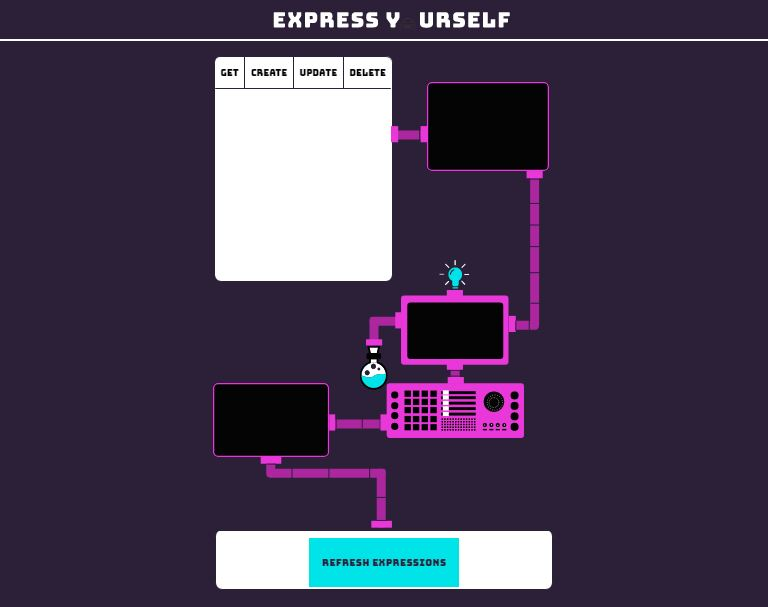
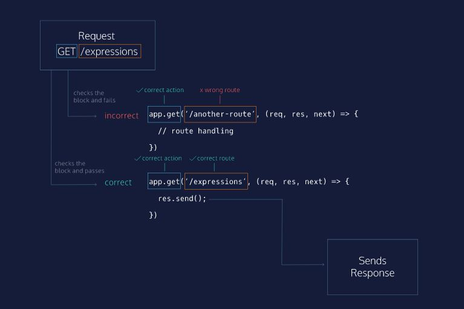

# Express Routes

LESSON

Learn about Express routes and how to write them.

## Matching Route Paths

Express intenta hacer coincidir las solicitudes por ruta, lo que significa que si enviamos una solicitud a <server address>:<port number>/api-endpoint, el servidor Express buscará en cualquier ruta registrada en orden e intentará hacer coincidir /api-endpoint.

