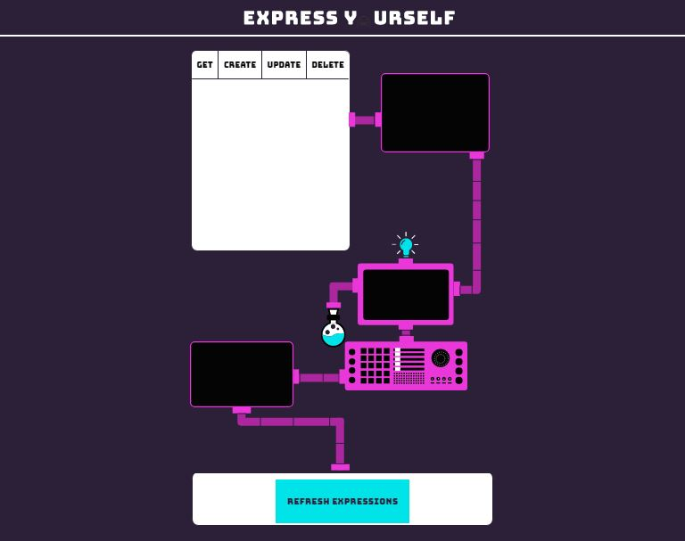
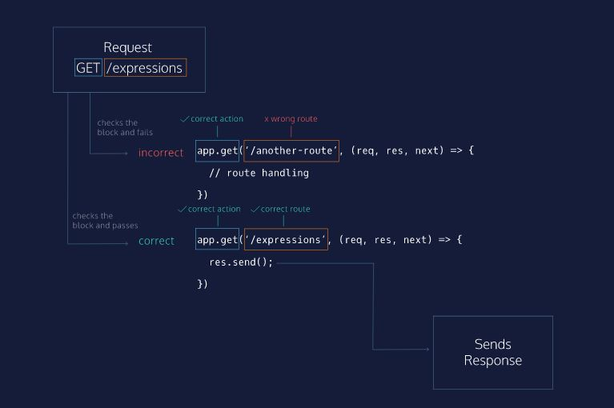
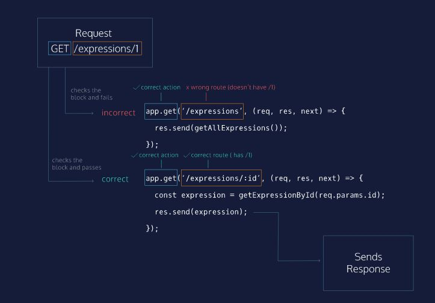
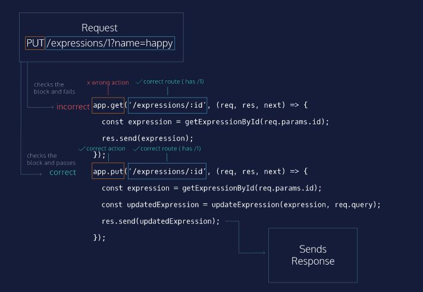
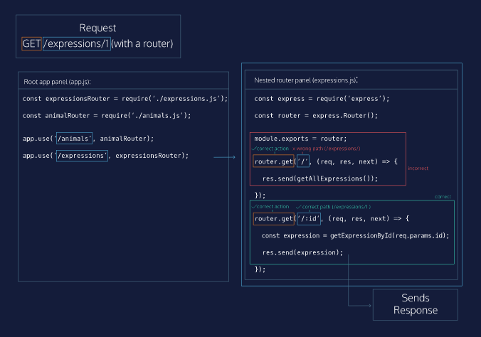

# Express Routes

LESSON

Learn about Express routes and how to write them.

## Matching Route Paths

Express intenta hacer coincidir las solicitudes por ruta, lo que significa que si enviamos una solicitud a <server address>:<port number>/api-endpoint, el servidor Express buscará en cualquier ruta registrada en orden e intentará hacer coincidir /api-endpoint.

## Matching Longer Paths

Los parámetros de ruta coincidirán con cualquier cosa en su parte específica de la ruta, por lo que una coincidencia de ruta coincidirá /monsters/:name

## Matching By HTTP Verb

Express coincide con las rutas utilizando la ruta y el verbo del método HTTP. En el diagrama de abajo, vemos una solicitud con un verbo PUT y /expressions(recuerde que la consulta no es parte de la ruta de ruta).

## Matching In Nested Routers

In the diagram to the down, you can create an Express application using two routers. A GET request arrives for /expressions/1. Because the beginning of the path does not match /animals in the first app.use(), the Express server moves on to the next app.use(), which matches /expressions.

